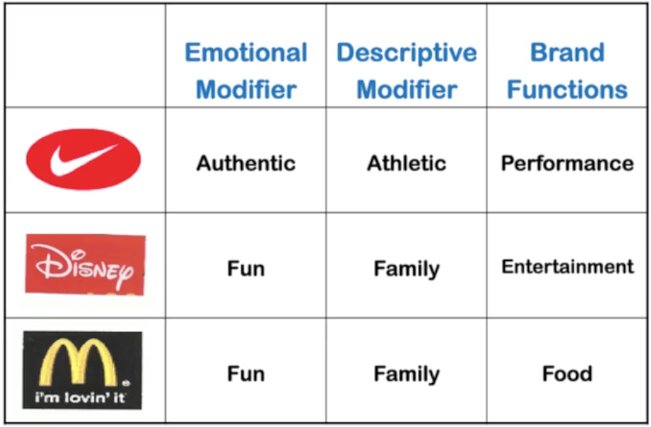
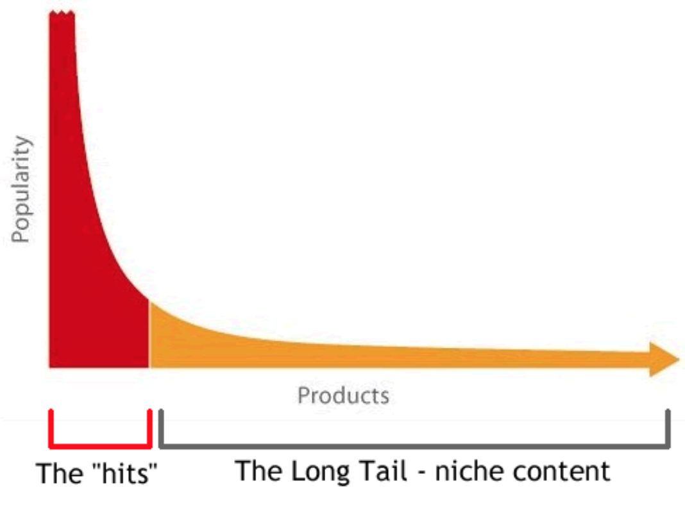
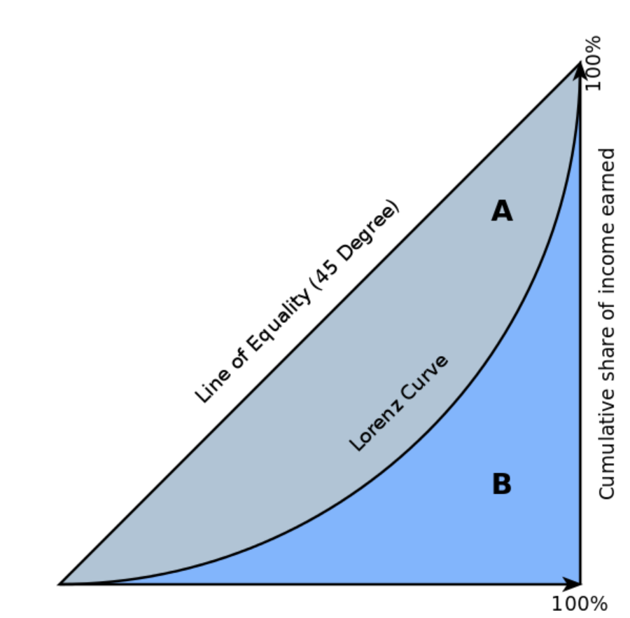

# Marketing Cheat Sheet

### Table of Contents

- [Branding](#branding)
- [Customer Centricity](#customer-centricity)
- [Go to Market Strategies](#go-to-market-strategies)
- [Resources](#resources)

## Branding

### Marketing 101: Building Strong Brands

**Market** is an exchange between two parties, usually a buyer and a seller.

**Seller's Market** - an economic situation in which goods or shares are scarce and sellers can keep prices high. 
Usually **Product Focused Marketing** is used in such markets.  

**Buyer's Market** - an economic situation in which goods or shares are plentiful and buyers can keep prices down.
Usually **Customer Focused Marketing** is used in such markets.

In product focused marketing you try do develop the best product/service and sell it to as many customers as possible.
Market share is the fraction of the market buying your product.

In customer focused marketing you pick customers and create products/services customized to their needs.
Customer share is the fraction of the maximum amount of product/services a customer can possibly buy from you.  

**Production Orientation** - persuade customer to want what the firm has.

**Marketing Orientation** - persuade firm to offer what the customer wants.
 
**Experience Orientation** - manage customer's entire experience with the firm.

**Trust Orientation** - prioritize building a relationship of trust and discipline. 

**3 Principles of Marketing**

1. **Principle of Customer Value** - you have to provide real value to customers.
2. **Principle of Differentiation** - you have to differentiate your offering from the competition.
3. **Principle of Segmentation, Targeting and Positioning** - you choose a segment of the market and position your brand 
to meet the needs of that target segment.

**4 P's of Marketing**

1. **Product** - what you offer.
2. **Place** - how the product will be provided to the customer. 
3. **Promotion** - advertising, sales promotions, special offers and public relations.
4. **Price** - the actual amount the end user is expected to pay for a product.  

### Strategic Marketing

**Market-Driven Principles**

1. Know your Markets
2. Customers choose the product that delivers the best on one of the dimensions they care most about:
  - **Product features/design** (style, innovation, technology)  
  - **Operational** (delivery, service, reliability) 
  - **Whether it meets their needs**
3. Commit to being first in the markets you serve.
4. Deliver total quality to guarantee customer satisfaction.

**Strategies for Leadership**

1. **Performance superiority** - focus on product features/design
2. **Operational excellence** - focus on operational aspects
3. **Customer Intimacy** - focus on meeting customers' needs

### Segmentation, Targeting and Positioning (STP)

1. **Segmentation** - identify variables that allow one to segment the market.
2. **Targeting** - evaluate the attractiveness of each segment and choose a target segment.
3. **Positioning** - identify positioning concepts for each target segment, select the best, and communicate it.

**Segmentation Methods** 

1. Characteristics of the customers - gender, race, age, geographical location.
  - Cohort analysis: Babyboomers, Generation X (1966-1976), Generation Y (1977-1997).
2. Benefits sought - e.g. for running shoes: comfort, aesthetics, technology.
3. Systematic, product-related behaviours - purchasing behaviour (buys weekly or monthly), by channel (online or in stores).
 
Formally a **brand** is a proprietary trademark for a specific product or service. 
Conceptually, a brand is a "contract"
from the company to its customers; a promise of specific benefits, quality, and value. A relationship.
Essentially, a brand is what consumers tell each other it is.

A **positioning statement** includes:

1. **Target Segment** (for whom)
2. **Point of Difference** (how it's different from competition)
3. **Frame of Reference** (the scope of products/services), also called Point of Parity

### Brand Mantra: The Elevator Speech

**Brand Mantra** is an articulation of the "heart and soul" of the brand. 
It's the "brand essence", a "core brand promise".

**Brand Mantra** is a short three- to five-word phrase that captures the irrefutable essence or spirit of the brand
positioning and brand values.

Considerations:
- Communicate
- Simplify
- Inspire

Parts of the brand mantra:
1. The **brand function** describes the nature of the product or service or the type of experiences or benefits the 
brand provides.
2. The **descriptive modifier** further clarifies its nature.
3. The **emotional modifier** provides another qualifier, that evokes emotions.

### Experiential Branding

Customer experiences are very  important for developing a brand because they trigger stimulations to the senses,
heart and mind. 

Redefining what a brand is from the experiential position:

- Differentiation -> Experience
- Promise -> Relationship
- Attributes -> Personality
- Static -> Dynamic
- Mass -> Individual
- Awareness -> Relevance 

## Customer Centricity 

### Cracks in the Product-Centric Approach

- Technology-enabled product development -> **commoditization**. Commoditization is the process by which goods that 
have economic value and are distinguishable in terms of attributes (uniqueness or brand) end up becoming simple 
commodities in the eyes of the market or consumers. It is the movement of a market from differentiated 
to undifferentiated price competition and from monopolistic competition to perfect competition.
- Technology-enabled information flow -> **smart customers**. They can easily switch to a competitor.
- Technology-enabled delivery -> **retail saturation**
- Customers want "**end-to-end solutions**", which may require products/services from multiple vendors.
- Information systems enable **customer-level tracking**   

### What is Customer Centricity

**Customer centricity** is a strategy that aligns a company's development/delivery of its products/services around 
the needs of a select set of customers in order to maximize their long-term financial value to the firm.

## Go to Market Strategies

### Online / Offline Competition

More than 90% of what is sold to consumers is still sold offline (2013). This is because there are still frictions:

- Delivery times
- Uncertainty about "fit and feel" of certain products
- Cost of returns (time and money)

But niche products, e.g. unpopular books, are only sold online.

### Frictions removed by online shops

1. **Search Friction** - it's easier to find what you need online.
2. **Geographic Friction** - the Internet can deliver to you from any place in the world.

## The Long Tail

The Internet opened up the possibility for easy access to products from the long tail, i.e. the less popular ones.

The graph shows that the Gini coefficient is equal to the area marked A divided by the sum of the areas marked A and B, 
that is, Gini = A / (A + B). 
It is also equal to 2A and to 1 − 2B due to the fact that A + B = 0.5 (since the axes scale from 0 to 1). 

Gini Coefficient can also be applied to the Long Tail of products.

### Preference Isolation

The stores are only motivated to put on the shelves the products that are most popular. Unique preferences are isolated
meaning they will not be satisfied by stores.

### How Internet Retailing Startups Grow

Two important patterns:

- In the beginning sales start out in larger cities and spread by proximity from person to person.
- Later on, sales pick up in smaller areas that are quite far apart, but that contain "similar" kinds of people.

## 4 Levels of Marketing

- 1P: Product
- 4P: Product, Price, Place, Promotion
- STP: Segmentation, Targeting, Positioning
- ME: Marketing is Everything 

## Resources

- Introduction to Marketing https://www.coursera.org/learn/wharton-marketing/home/welcome
- Philip Kotler: Marketing https://www.youtube.com/watch?v=sR-qL7QdVZQ
